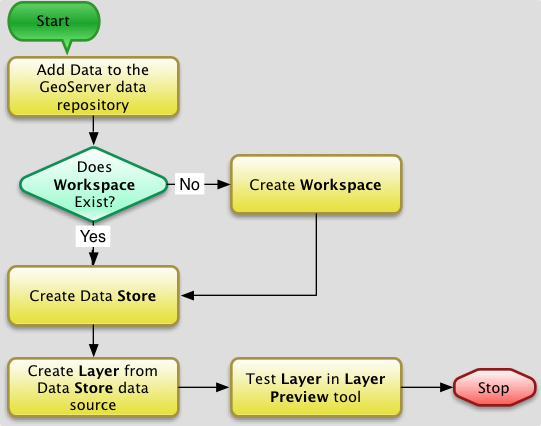

---
title: Week 12 - Module 5 - Platforms and GeoServer Introduction
...

<!---------------------------------------------------------------------------->
<!-- Week 13 ----------------------------------------------------------------->
<!-- Lecture 05 a 01 a ------------------------------------------------------->
<!-- Developing and Hosting OGC Services-------------------------------------->
<!-- Platforms and GeoServer Introduction------------------------------------->
<!---------------------------------------------------------------------------->

###Overview ###{.module05a01a}

* SOA Review
* Server Platform
* Online Mapping Server Applications: COTS & Open Source
* What is GeoServer
* Working with GeoServer
* Demonstration

### SOA Review ###{.module05a01a .oneup}

* Services Oriented Architecture (SOA) for Geospatial Data and Processing
	* Data, Processing & Client Tiers
* Open Geospatial Consortium Interoperability Standards
	* WMS, WFS, WCS
* Geospatial Metadata Standards
	* ISO 19115, FGDC
* Internet Standards
	* Web: HTML, CSS, JavaScript, XML
	* SOAP - Simple Object Access Protocol
	* REST - Representation State Transformation

### Server Platform ###{.module05a01a}

In the context of server platforms for online mapping with OGC services, there are several components that are of interest

* The operating system - the software environment in which all applications on a computer operate (e.g. Windows, Mac OS X, Linux)
* The web server - the application that listens for incoming requests from the Internet (e.g. Apache, IIS)
* The mapping server - the application (that may also include the web server) that enables online mapping applications, that may include support for one or more OGC service interfaces (e.g. GeoServer, MapServer, CubeWerx, ArcGIS Server)

### Online Mapping Server Applications ###{.module05a01a}

Sample Commercial Off-the-Shelf (COTS)

* ArcGIS Enterprise ([info](http://www.esri.com/en/arcgis/products/arcgis-enterprise/overview))
* CubeWerx SDI Suite ([info](http://www.cubewerx.com/solutions/sdi/))
* ERDAS APOLLO ([info](http://www.hexagongeospatial.com/products/provider-suite/erdas-apollo))

Sample Open Source

* MapServer ([info](http://mapserver.org/))
* GeoServer ([info](http://geoserver.org/))
* QGIS ([info](http://docs.qgis.org/2.14/en/docs/user_manual/working_with_ogc/ogc_server_support.html))

### What is GeoServer ###{.module05a01a}

GeoServer is an Open Source, Open Standards supporting geospatial web services platform

* GNU General Public License
* WMS, WFS, WCS
* Written in Java as a web application commonly hosted on the Jetty HTTP server and Java servlet engine
* An appropriate version of Java must already be installed

### Working with GeoServer ###{.module05a01a}

OS-Independent Binaries are Available for Multiple Platforms (these are just ‘run’ to start the server)

* Includes the Jetty HTTP server
* Windows, Mac OS X, Linux
* There are OS-specific configuration instructions for each operating system

GeoServer may be integrated into existing Java web servlet applications (such as Apache Tomcat) using the available Web Archive (WAR) file. 

OS-Specific Installers are also Available

* Include an integrated HTTP server
* Windows and Mac OS X

[Installation Information]    (http://docs.geoserver.org/stable/en/user/installation/)

### What is Happening Behind the Scenes ###{.module05a01a .oneup}

### Setup and Configuration ###{.module05a01a}

* After the initial setup as part of the installation process, other setup and configuration is performed through the web interface
* All configuration activities require that you are logged in as an administrator
* Default username and password for a new GeoServer are `admin:geoserver` - this should be changed as soon as you start up a new server instance.
* After logging in you can view and modify the configuration of the server and services - some of the configuration elements inform the OGC service capabilities

### Server Configuration Options ###{.module05a01a .oneup}

* Server Status - summary information about the status of the currently running server
* GeoServer Logs - access to the application logs for diagnosing issues with the server
* Contact Information - contact information for the person responsible for providing support for the server and services. This information is used to build parts of the Capabilities XML metadata returned by the services
* About GeoServer - links to information about GeoServer
* Image Processing - advanced image processing and raster encoding
* Raster Access - settings for accessing raster data

### WxS Service Configuration Options ###{.module05a01a .oneup}

Options Common to all WxS services

* Enable/disable the service, with or without strict CITE compliance
* Maintainer and Online Resource URLs
* Title/Abstract
* Fees/Access Constraints
* Keywords

Options specific to individual services

* WFS - max. no. features, service type (basic/transactional/complete), GML-specific styles, SRS styes, other options
* WMS - SRS subset specification, interpolation method, resource consumption limits, KML options, map image watermarking, PNG/JPEG/SVG format options, and others
* WCS - SRS subset specification, policies for overviews to be used, subsampling, and resource consumption limits, other options

### Data Component Configuration Options ###{.module05a01a .oneup}

* _Layer Preview_ -  An interface through which a _Layers_ may be previewed in a variety of formats
* _Workspaces_ - Defined containers for related data products
* _Stores_ - Specific data sources (file or service based) with required data type and connection information provided in the _Store_ configuration
* _Layers_ - Defined layers that are published by the server, with the layers based upon data provided by a _Store_, but with additional layer-specific settings (such as bounding box, applied and available styles,and attribution).
* _Layer Groups_ - Collections of _Layers_ for specific projects/applications or other logical groupings.
* _Styles_ - A listing of defined layer styles for the server through which those styles may be accessed and managed. 

### Data Integration Process ###{.module05a01a .oneup}

### Security Settings ###{.module05a01a .oneup}

* _Settings_ - Basic security configuration settings: role service, encryption options
* _Authentication_ - Configuration settings for authentication providers for users
* _Passwords_ - Settings related to underlying password providers and policies
* _Users, Groups, Roles_ - Management of system users, groups and defined roles
* _Data_ - Settings for read/write access to data products within the server, settings for the system's *catalog mode*
* _Service_ - Settings for managing service-level (i.e. WMS, WFS, WCS and related request types) access privileges by user role. 

### Demonstration of GeoServer Interface ###{.module05a01a .oneup}

[Class GeoServer Instance](http://mapper.internetmapping.net:8081/geoserver/web/)

